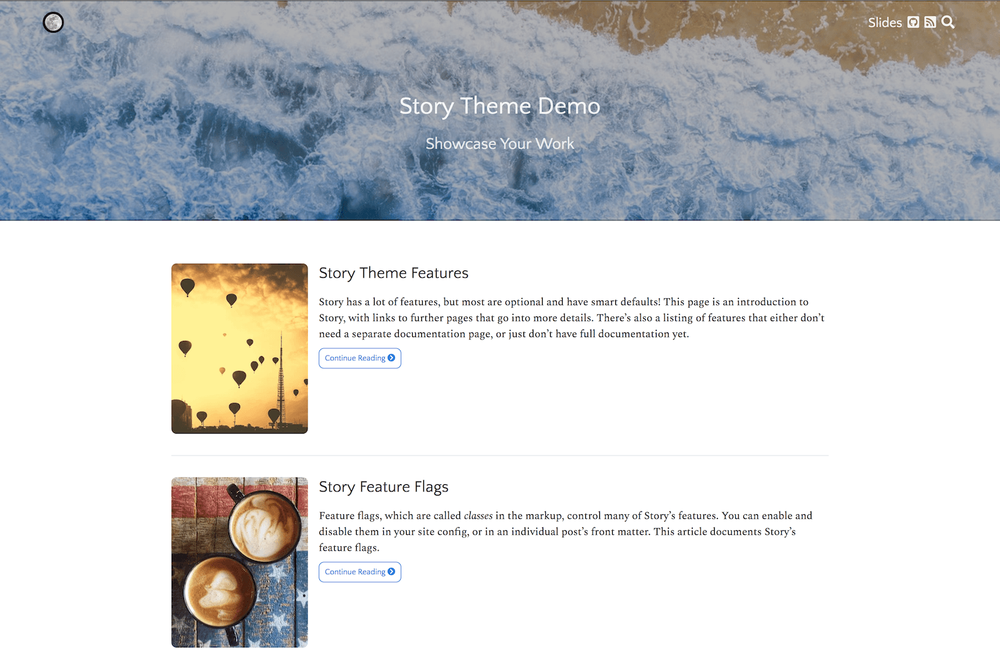

# Story

Story is a beautiful [Hugo theme](https://gohugo.io) for showcasing your writing
and presentations.

Story is targeted to technical writers and
speakers: people such as software engineers and open source developers, who want a
website for their technical work, such as blogging about software
engineering. It's a great way to share your writing and speaking with the world.

It has a lot of features for people who invest effort in their websites and blogs!

- Beautiful, responsive typography for long-form content on screen and in print, including blogs and single pages.
- Support for [RemarkJS slides](https://remarkjs.com/).
- LaTeX math typesetting with [KaTeX](https://github.com/Khan/KaTeX)
- A built-in search page with [LunrJS](https://github.com/olivernn/lunr.js).

This is just a fraction of Story's feature set, see the demo site for much more
documentation and screenshots.
