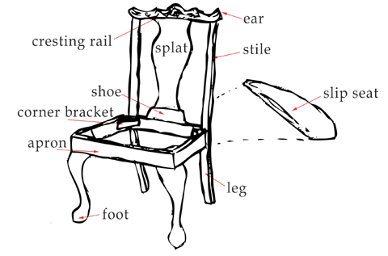

class: title
background-image: url(leo-serrat-533922-unsplash.jpg)

# The Adirondack RemarkJS Theme
## Baron Schwartz &bullet; 2018

---
# The Adirondack RemarkJS Theme

Adirondack is a beautiful typography theme for RemarkJS,
built upon [Apron](/slides/apron) layouts.

## This Slideshow's Purpose

* This slideshow is a demo.
* It uses no RemarkJS syntax extensions. There's __no raw HTML__ or `
` elements, _just Markdown_.

### Avondale-Upon-The-Sea

> I thought nostalgically, as I gazed at the lengthening shadows, that a day
> lived in this paradise was worth a year anywhere else.

---
class: img-caption

## The Waves Broke Gently Upon The Soft Shore

---
class: two-col-img-left

# Layout Class two-col-img-left

In this convenience layout, the first paragraph in the content
(which can be an image, as in this case)
will form the left column.

The paragraph is floated left and sized to 50%, and should
prevent wrapping around underneath it.

Test.

Test.

Test.

Test.

Test.

Test.

Test.

Test.

---
class: two-col-img-right

# Layout Class two-col-img-right

In this convenience layout, the first paragraph 
will form the right column.

--

The reason for these two-column image convenience slide classes is to avoid any
wrapper div's or similar.

--

This allows RemarkJS to do incremental slide builds, with the `--` separator
between stages of slides.

---
class: img-fullbleed-right

# Layout Class img-fullbleed-right

This slide illustrates the img-fullbleed-right convenience class.

The first image in the slide is set to 40% of the width of the slide and set
full-bleed on the right-hand edge of the slide.

The image's position within the clipped container is set to `left`. This allows
you to create images that are 2x as wide as the area that's displayed, and pair
this layout with the next one.

---
class: img-fullbleed-left

# Layout Class img-fullbleed-left

This slide illustrates the img-fullbleed-left convenience class.

The image is the same as on the previous slide, but the positioning within the
container is the opposite, so the other half of the image is shown.

The next slide illustrates an image collage with three images, full-bleed.

The one after that is more sophisticated and demonstrates Apron's system of
12ths in units. All of this works in both 16:9 and 4:3 aspect ratios.

---
class: fullbleed
background-color: black

---
class: fullbleed
background-color: black

---
class: col, col-2

# Apron's Columnar Layouts

Apron supports multi-column layouts (2 and 3). This is a two-column layout.
The first element (typically heading) spans all columns.

Create a columnar layout with `class: col, col-X`.

Images are supported too.

- Lists are not supposed to break across columns.
- Lists are not supposed to break across columns.
- Lists are not supposed to break across columns.
- Lists are not supposed to break across columns.
- Lists are not supposed to break across columns.
- Lists are not supposed to break across columns.
- Lists are not supposed to break across columns.
- Lists are not supposed to break across columns.
- Lists are not supposed to break across columns.
- Lists are not supposed to break across columns.

This slide has paragraphs, images, and lists.

1. Here's a numbered list.
1. Here's a numbered list.

It's followed by a paragraph.

---
class: col, col-3

# Apron's 3-Column Layout

This is a three-column layout,
created with `class: col, col-3`.

Images are supported too.

- Lists are not supposed to break across columns.
- Lists are not supposed to break across columns.
- Lists are not supposed to break across columns.
- Lists are not supposed to break across columns.
- Lists are not supposed to break across columns.
- Lists are not supposed to break across columns.
- Lists are not supposed to break across columns.
- Lists are not supposed to break across columns.
- Lists are not supposed to break across columns.
- Lists are not supposed to break across columns.

This slide has paragraphs, images, and lists.

1. Here's a numbered list.
1. Here's a numbered list.

It's followed by a paragraph.

---
# Apron's Slide Classes

Apron defines the following slide classes:

- title: centers text in all directions, and sets background images to cover
- img-caption: assumes the content is an image and a caption; makes the image
  take up the top of the slide (fullbleed) and puts the rest below, centered
- two-col-img-right: assumes you begin the content with an image, which takes up
  the right-hand 50% of the slide
- two-col-img-left: the same, but left-hand 50%
- img-fullbleed-right and img-fullbleed-left: ditto, but the image is
  full-height and full-bleed to the edge of the slide
- col: use together with col-2 and col-3
- col-2 and col-3: all but the first element in the slide is laid out in the
  specified number of columns

Additionally, there are the following utility classes:

- fullbleed: removes margins and paddings from the slide container and from
  `
` elements.
- debug{,-white,-black}: outlines elements for debugging
- debug-grid{,-16,-8-solid,-16-solid}: creates a grid background for layout

---
# Why Is It Named Apron?

For some reason, I named these slideshow layouts after iconic types of chairs
(monobloc, adirondack, etc).

The apron is the part of the chair upon which everything rests, so this
"supporting" set of CSS got the name "apron."

Credit: http://www.props.eric-hart.com/
