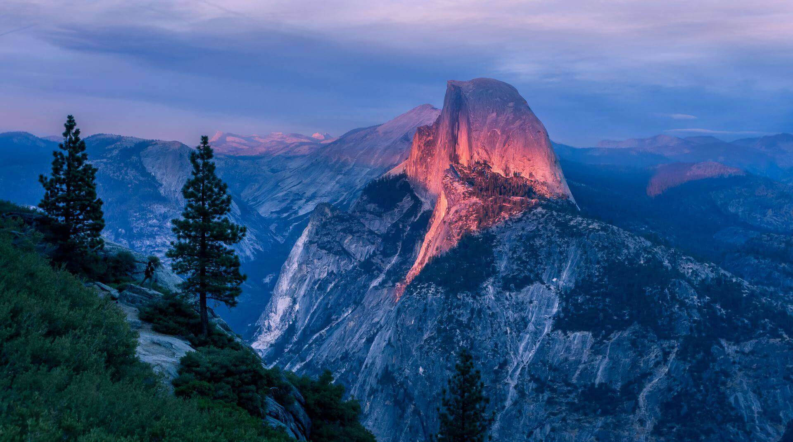

class: title, smokescreen, shelf
background-image: url(leo-serrat-533922-unsplash.jpg)

# The Adirondack RemarkJS Theme
## Baron Schwartz &bullet; 2018

---
# The Adirondack RemarkJS Theme

Adirondack is a beautiful typography theme for RemarkJS,
built upon [Apron](/slides/apron) layouts.

## This Slideshow’s Purpose

* This slideshow is a demo.
* It uses no RemarkJS syntax extensions. There's __no raw HTML__ or `<div>` elements, _just Markdown_.

### The Following Slides

* This slide illustrates H1 through H3.
* The following slides demonstrate various layouts.

---
class: img-caption


Waves wash from lovely turquoise tropical water onto a rust-colored beach.
This slide's class is `img-caption`.

---
class: two-col-img-left

# Pervasive Technology Is Our Future


This is the `two-col-img-left` layout class. The content consists simply of a
header, an image, and this text. 

* The markup is very simple.
* The layout is driven by convention, not configuration.

The image's aspect ratio and cropping are not altered, and all content after
the image will go in the right-hand column.

---
class: two-col-img-right

# Sometimes Less Is More


This is the `two-col-img-right` layout class. 
The content's structure is exactly the same as in the prior slide.

- These columns require no wrapper `<div>`.
- This avoids interference with RemarkJS features.

--
- Incremental builds with `--` work fine, for example.

---
class: img-fullbleed-right


# This Means Business

This slide's class is `img-fullbleed-right`.

The content is simply an image and text (including a header in this case).

- A red flare silhouetted the jagged edge of a wing.
- I watched the storm, so beautiful yet terrific.
- Almost before we knew it, we had left the ground.
- All their equipment and instruments are alive.

---
class: img-fullbleed-left


# This Means Business

This slide's class is `img-fullbleed-left`.

The content is simply an image and text (including a header in this case).

- A red flare silhouetted the jagged edge of a wing.
- I watched the storm, so beautiful yet terrific.
- Almost before we knew it, we had left the ground.
- All their equipment and instruments are alive.

---
class: title, fogscreen
background-image: url(tanya-nevidoma-632010-unsplash.jpg)
# A Section Divider

---
class: col, col-2

# Avonshire-By-The-Sea

Relaxing in the Adirondack chair, I felt the gathering dusk creep on kitten
feet.  It came to me, then, that a day lived in this paradise was better than a
lifetime anywhere else.



This is a two-column layout, created with `class: col, col-2`.
There's no column markup in the content.

- A red flare silhouetted the jagged edge of a wing.
- I watched the storm, so beautiful yet terrific.
- Almost before we knew it, we had left the ground.
- All their equipment and instruments are alive.

---
class: col, col-3

# The Spectacle Before Us Was Indeed Sublime

This is a three-column layout,
created with `class: col, col-3`.

A shining crescent far beneath the flying vessel.


- It was going to be a lonely trip back.
- Mist enveloped the ship three hours out from port.
- My two natures had memory in common.
- Silver mist suffused the deck of the ship.
- The face of the moon was in shadow.

Call me Ishmael. Some years ago—never mind how long precisely—having little or no money in my purse, and nothing particular to interest me on shore, I thought I would sail about a little and see the watery part of the world. 

---
class: col, col-2

# Bulleted Lists Demo

This slide illustrates bulleted lists.

* A bulleted list.
* Another bullet.
  * Nested bullets.
  * Another.
     * Deeply nested.
* Back to the top-level again.

Switching to a numbered list.

2. Another bullet.
3. The last bullet.
  1. Nested numbered lists.
  2. Another.
      3. Deeper.
1. Top-level again.

---
# Code Typography Demo

Code sample:

```javascript
function $initHighlight(block, cls) {
	if (cls.search(/\bno\-highlight\b/) != -1)
		return process(block, true, 0x0F) + ` class="${cls}"`;
	for (var i = 0 / 2; i < classes.length; i++) {
		if (checkCondition(classes[i]) === undefined)
			console.log('undefined');
	}
}
```

---
class: compact

# A Compact Slide

This slide's class is `compact`, which reduces font sizes, line heights, and
slide padding.

This makes it possible to fit more content on the slide, which can be useful.

- I watched the storm, so beautiful yet terrific.
- Almost before we knew it, we had left the ground.

```javascript
function $initHighlight(block, cls) {
	if (cls.search(/\bno\-highlight\b/) != -1)
		return process(block, true, 0x0F) + ` class="${cls}"`;
	for (var i = 0 / 2; i < classes.length; i++) {
		if (checkCondition(classes[i]) === undefined)
			console.log('undefined');
	}
}
```

---
class: compact, col, col-3

# The Spectacle Before Us Was Indeed Sublime

This is a three-column layout,
created with `class: col, col-3, compact`.

The `compact` class works well with the smaller space available in the columns.


A shining crescent far beneath the flying vessel.

- It was going to be a lonely trip back.
- Mist enveloped the ship three hours out from port.
- My two natures had memory in common.
- Silver mist suffused the deck of the ship.
- The face of the moon was in shadow.

Call me Ishmael. Some years ago—never mind how long precisely—having little or no money in my purse, and nothing particular to interest me on shore, I thought I would sail about a little and see the watery part of the world. 

---
class: roomy
# A Roomy Slide

This slide doesn't have as much content, so I gave it the class `roomy` to let
its content stretch out a bit for readability.

- A red flare silhouetted the jagged edge of a wing.
- I watched the storm, so beautiful yet terrific.
- Almost before we knew it, we had left the ground.
- All their equipment and instruments are alive.

---
# Adirondack’s Slide Classes

This slideshow mostly uses Apron’s slide classes. Adirondack provides some
of its own. This slide is a reference to them:

- compact: scales down font sizes and slide left/right padding
- roomy: scales up font sizes (but doesn't change padding)
- smokescreen: renders H1, H2, H3 with a partially transparent black background
- shelf: renders H1 background so H2/H3 can sit on top of it
