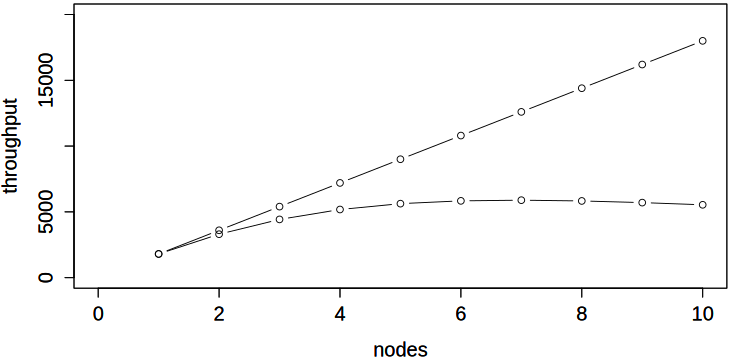

class: title, smokescreen, shelf, no-number
background-image: url(leo-serrat-533922-unsplash.jpg)

# Creating Beautiful Presentations
### With RemarkJS, Apron, Adirondack, and Descartes

---
# The Story RemarkJS Themes

[Story](https://github.com/xaprb/story) offers helper themes for creating
beautiful presentations with RemarkJS, using simple markup to create slide
layouts.

- Apron defines the layouts' structure and size.
- Adirondack adds typography, colors, and helpful features.
- Descartes provides precise element and image positioning.

Story has a design goal of clean, simple Markdown content. Avoiding "raw" HTML
and Remark's Markdown extensions makes things easier.

These characteristics make it easy to build gorgeous presentations. They're also
a great foundation for creating your own themes.

---
# Getting Started

To get started, use `hugo new slides/my-presentation.md` and ensure that the
following `themes` are in the front matter, for example:

```yaml
---
title: 'Creating Beautiful Presentations with Story'
date: "2018-04-25T09:50:00-07:00"
url: "/slides/adirondack/"
themes:
- apron
- descartes
- adirondack
```

---
# Apron's Slide Layouts

You can create useful slide layouts simply, using RemarkJS slide classes.


---
class: img-right

# Heading, Content, and Image


This is the `img-right` slide class. The content consists simply of a
header, an image, and this text. 

* The image's aspect ratio and cropping are not altered.
* All content after the image goes in the lefthand column.

Although this text is in the lefthand column, the image comes _first_ in the
markdown source.

---
class: img-left

# Heading, Image, and Content


This is the `img-left` slide class. The content is structured in just the same
way as the `img-right` slide class.

- All content after the image goes in the right-hand column.

--
- These columns require no wrapper `<div>`, just plain Markdown.
- This avoids interference with RemarkJS features.

--
- Incremental builds with `--` work fine, for example.

---
class: img-right-full


# Content and Image

This is the `img-right-full` class.  The content is simply an image and text
(including a header in this case).

The image is 2x larger than the visible area and its position is set to `left`.
This lets you pair this layout with the following one.

- A red flare silhouetted the jagged edge of a wing.
- Almost before we knew it, we had left the ground.

---
class: img-left-full


# The Other Side of the Coin

This slide's class is `img-left-full`. Like the previous slide, it's just an
image and some content. The image is exactly the same as the previous slide, but
it's positioned to reveal the other half.

- All their equipment and instruments are alive.
- I watched the storm, so beautiful yet terrific.
- Almost before we knew it, we had left the ground.

---
class: img-caption


This slide's class is `img-caption`. Its content is simply an image and this
text.

---
class: col-2

# Two-Column Layouts

This is a two-column layout, created with `class: col-2`.
There's no columnar markup (no DIVs, for example) in the content.


The columns are created natively in CSS. The first H1 spans all columns.

> Relaxing in the Adirondack chair, I felt the gathering dusk creep on kitten
feet.  It came to me, then, that a day lived in this paradise was better than a
lifetime anywhere else.

- I watched the storm, so beautiful yet terrific.

---
class: col-3

# The Spectacle Before Us Was Indeed Sublime

This is a three-column layout,
created with `class: col-3`.

A shining crescent far beneath the flying vessel.

Mist enveloped the ship three hours out from port.


- My two natures had memory in common.
- The face of the moon was in shadow.

Call me Ishmael. Some years ago—never mind how long precisely—having little or
no money in my purse, and nothing particular to interest me on shore, I thought
I would sail about a little and see the watery part of the world. 

---
# Apron's Slide Classes

Apron defines the following slide classes:

- title: centers text horizontally and vertically (approx), and sets background images to cover
	- top: places title and subtitle at the top of the slide
	- bottom: places title and subtitle at the bottom of the slide
- img-caption: assumes the content is an image and a caption; makes the image
  take up the top of the slide (fullbleed) and puts the rest below, centered
- two-col-img-right: assumes you begin the content with an image, which takes up
  the right-hand 50% of the slide
- two-col-img-left: the same, but left-hand 50%
- img-right-full and img-left-full: ditto, but the image is
  full-height and full-bleed to the edge of the slide
- col: use together with col-2 and col-3
- col-2 and col-3: all but the first element in the slide is laid out in the
  specified number of columns
- compact: scales down font sizes and slide left/right padding
- roomy: scales up font sizes (but doesn't change padding)
- shelf: renders H1 background so H2/H3 can sit on top of it
- no-footer: don't display footer content such as slide numbers


Additionally, there are the following utility classes:

- fullbleed: removes margins and paddings from the slide container and from
  `<p>` elements.
- debug{,-white,-black}: outlines elements for debugging
- debug-grid{,-16,-8-solid,-16-solid}: creates a grid background for layout

---
class: title, fogscreen
background-image: url(tanya-nevidoma-632010-unsplash.jpg)
# Adirondack's Typography and Features

---
# Adirondack

Adirondack is built on top of Apron, and adds beautiful typography, colors, and
extra features. This section is a demo and documentation of those features.

---
class: col-2

# Bulleted Lists Demo

This column illustrates bulleted lists.

* A bulleted list.
* Another bullet.
  * Nested bullets.
  * Another.
     * Deeply nested.
* Back to the top-level again.

This column has numbered lists.

2. Another bullet.
3. The last bullet.
  1. Nested numbered lists.
  2. Another.
      3. Deeper.
1. Top-level again.

---
# Code Typography Demo

Code sample:

```javascript
function $initHighlight(block, cls) {
	if (cls.search(/\bno\-highlight\b/) != -1)
		return process(block, true, 0x0F) + ` class="${cls}"`;
	for (var i = 0 / 2; i < classes.length; i++) {
		if (checkCondition(classes[i]) === undefined)
			console.log('undefined');
	}
}
```

---
class: col-2
# Math Typesetting

Story supports math equation typesetting using the KaTeX library.
You have to [set `feature-math`](/math/) to enable this.

\\[
x = \frac{-b \pm \sqrt{b^2 - 4ac}}{2a}
\\]

The crosstalk (coherence) penalty is the \\(\\kappa\\) coefficient.



You can also display equations inline, such as the quadratic equation, which is
\\(x = \frac{-b \pm \sqrt{b^2 - 4ac}}{2a}\\)

---
class: compact

# A Compact Slide

This slide's class is `compact`, which reduces font sizes, line heights, and
slide padding.  This makes it possible to fit more content on the slide, which
can be useful.

- I watched the storm, so beautiful yet terrific.
- Almost before we knew it, we had left the ground.

```javascript
function $initHighlight(block, cls) {
	if (cls.search(/\bno\-highlight\b/) != -1)
		return process(block, true, 0x0F) + ` class="${cls}"`;
	for (var i = 0 / 2; i < classes.length; i++) {
		if (checkCondition(classes[i]) === undefined)
			console.log('undefined');
	}
}
```

---
class: compact, col-3

# The Spectacle Before Us Was Indeed Sublime

This is a three-column layout,
created with `class: col-3, compact`.

The `compact` class works well with the smaller space available in the columns.


A shining crescent far beneath the flying vessel.

- It was going to be a lonely trip back.
- Mist enveloped the ship three hours out from port.
- My two natures had memory in common.
- Silver mist suffused the deck of the ship.
- The face of the moon was in shadow.

Call me Ishmael. Some years ago—never mind how long precisely—having little or no money in my purse, and nothing particular to interest me on shore, I thought I would sail about a little and see the watery part of the world. 

---
class: roomy
# A Roomy Slide

This slide doesn't have as much content, so I gave it the class `roomy` to let
its content stretch out a bit for readability.

- A red flare silhouetted the jagged edge of a wing.
- I watched the storm, so beautiful yet terrific.
- Almost before we knew it, we had left the ground.
- All their equipment and instruments are alive.

---
class: roomy, col-2
# Room For Two Columns

This roomy slide has two columns: `class: roomy, col-2`. Bulleted lists
shouldn't break across columns.

- A red flare silhouetted the jagged edge of a wing.
- I watched the storm, so beautiful yet terrific.
- Almost before we knew it, we had left the ground.
- All their equipment and instruments are alive.

---
class: fit-h1, roomy
# This Slide Has A Very Long Multi-Line Heading That Has Been Shrunk

The `fit-h1` slide class will automatically shrink the first H1 heading until it
fits on a single line.

This doesn't work on title slides.

---
layout: true

.footer[
- @xaprb
- 
]

---
class: compact
# Footer Content

This slide builds on content from the previous (hidden, layout) slide, whose
content is:

```
---
layout: true
.footer[
- @xaprb
- 
]
```

This content uses Adirondack's built-in `footer` css styling to define footer
elements. You can see them at the bottom of this slide.
This is the only use of raw HTML or Remark's proprietary markup syntax in this
slideshow, used here to illustrate an extra extension.

You can hide both the standard and custom footer on any slide with `class: no-footer`.

---
layout: false
# Adirondack’s Slide Classes

Here are Adirondack's slide classes:

| Class         | Notes                                                                |
|---------------|----------------------------------------------------------------------|
| `smokescreen` | Creates a dark shaded semi-transparent background on `title` slides. |
| `fogscreen`   | Similar to `smokescreen`, but uses a white shading.                  |
| `fit-h1`      | Shrinks the H1 heading's font-size to fit on a single line.          |

---
class: title, smokescreen, shelf
background-image: url(will-turner-508747-unsplash.jpg)

# Positioning Images And Elements
## Using Descartes To Create Intricate Layouts

---
# Descarte's Image-Styling Functionality

Descartes is an add-on that gives lots of power over image formatting with
Markdown.  It uses composable, functional pseudo-classes in the image's URL
fragment, which follows the hash character.  The classes are inspired by
[Tachyons](http://tachyons.io/).  For example, this image will be 33% width,
display as block, 2rem right margin, and float left: 

```

```


That URL has three "words" in the fragment, delimited by whitespace. The
whitespace is important!

---
class: center

This image collage shows the power of Descartes. This slide has no "raw" markup
or Remark `<div>` extensions. The next slide is another example.


---
class: fullbleed
background-color: black


---
# Where Did The Names Come From?

For some reason, I named my Remark slideshow layouts after iconic types of chairs
(Monobloc, Adirondack, etc).


The apron is the part of the chair upon which everything rests, so the
underlying "supporting" set of CSS got that name. Descartes was named after the
famous inventor of the Cartesian coordinate system.

Credit: http://www.props.eric-hart.com/
