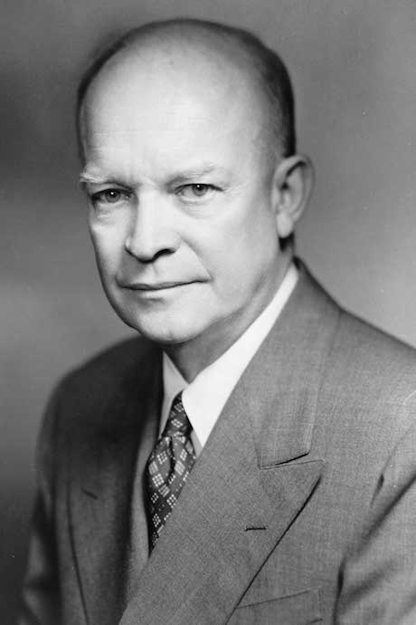

class: title, smokescreen, shelf
background-image: url(will-turner-508747-unsplash.jpg)

# A RemarkJS Demo Slideshow
## Baron Schwartz &bullet; SomeOpenSourceConf 2018

---
class: title, smokescreen
background-image: url(leo-serrat-533922-unsplash.jpg)
# Environment shapes culture

---
class: two-col-img-right
# Math Typesetting Works!

Represents crosstalk (coherence) penalty by coefficient \\(\\kappa\\).

\\[
X(N) = \frac{\\lambda N}{1+\\sigma(N-1)+\\kappa N(N-1)}
\\]

The system completes _less_ work as the load increases!

---
class: title, fogscreen
background-image: url(tom-barrett-364228-unsplash.jpg)
# Open source is key to our future

---
class: img-fullbleed-right

# A people that values its privileges above its principles soon loses both.

— Dwight D. Eisenhower
